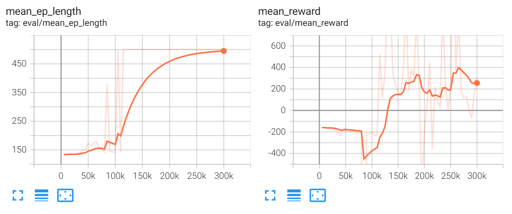

# Unitree Go1 四足行走（PPO + MuJoCo）

用 PPO 训练四足机器人在 MuJoCo 中行走。

## 效果
- 1000 步前进 **5.00 米**
- 最高速度 1.49 m/s
- 全程不摔倒

## 训练说明

本项目使用 PPO 算法，在 MuJoCo 仿真环境中训练 Unitree Go1 四足机器人行走。

训练分为三个阶段：
1. 站立训练（20 万步）
2. 行走训练（30 万步）
3. 步态优化（20 万步）

总计约 70 万步，最终模型在 1000 步内稳定行走 5.00 米。

如果你希望从头训练，请运行：

```bash
python train.py
```

## 训练曲线



## 推理方式

本项目支持三种推理方式：

| 方式 | 脚本 | 结果 |
|------|------|------|
| SB3 推理 | `test.py` | 5.00 米 |
| ONNX 推理 | `deploy/inference.py` | 5.00 米 |
| 纯 NumPy 推理 | `deploy/numpy_inference.py` | 3.64 米（浮点误差内一致） |

## 鲁棒性测试（Sim-to-Sim）

本项目在域随机化环境下训练，模型对物理参数变化具有鲁棒性：

| 扰动 | 距离 | 相对基准 |
|------|------|---------|
| 基准 | 6.73 米 | 100% |
| 质量+10% | 7.24 米 | 107% |
| 摩擦-30% | 6.96 米 | 103% |

域随机化训练方法：
- 质量扰动：±8%
- 摩擦扰动：±15%
- 训练步数：100 万步

### ONNX 导出

```bash
python deploy/export_onnx.py
```

## 快速演示

```bash
python demo.py
```

## 测试

```bash
python test.py
```

## 项目结构

```
env/            环境代码
models/         训练好的模型
docs/           文档与训练曲线
deploy/         ONNX 导出与推理脚本
train.py        训练脚本
test.py         测试脚本
demo.py         快速演示脚本
```

## 依赖

- Python 3.10+
- MuJoCo
- PyTorch
- stable-baselines3
- onnx, onnxruntime（ONNX 推理需要）